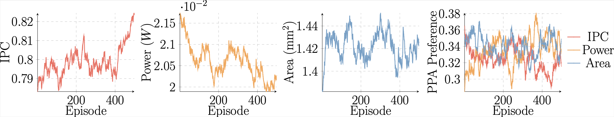
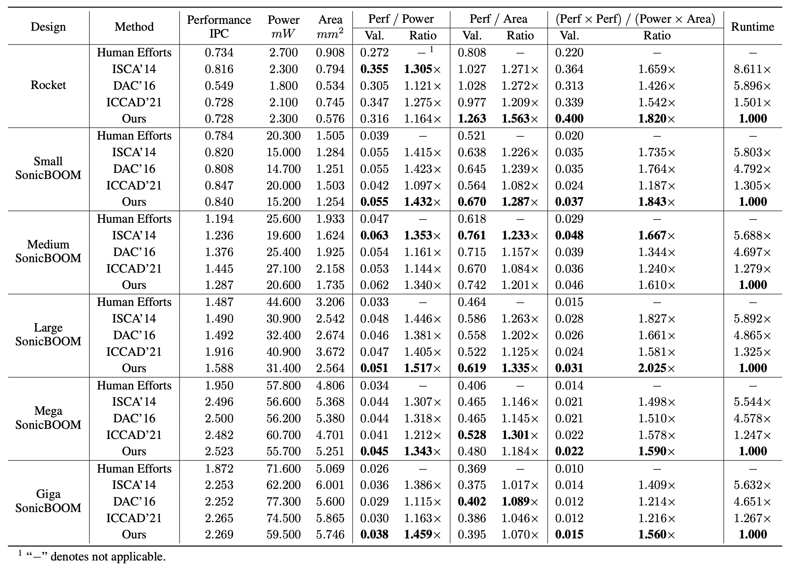

# Towards Automated RISC-V Microarchitecture Design with Reinforcement Learning

## Description

Microarchitecture determines the implementation of a microprocessor.
Designing a microarchitecture to achieve better performance, power, and area (PPA) trade-off has been increasingly difficult.
Previous data-driven methodologies hold inappropriate assumptions and failed to tightly couple with expert knowledge.
In this repo., we release a novel reinforcement learning-based (RL) solution that addresses these limitations.
With the integration of microarchitecture scaling graph, PPA preference space embedding, and proposed lightweight environment in RL, experiments using commercial electronic design automation (EDA) tools show that our method achieves an average PPA trade-off improvement of 16.03% than previous state-of-the-art approaches with 4.07× higher efficiency.
The solution qualities also outperform human implementations by at most 2.03× in the PPA trade-off.


## Folder organizations

The folder tree is shown below.

```bash
rl-explorer
├── LICENSE
├── README.md
├── __init__.py
├── baselines
│	 ├── boom_explorer
│	 │	 ├── LICENSE
│	 │	 ├── README.md
│	 │	 ├── algo
│	 │	 │	 ├── boom_explorer.py
│	 │	 │	 ├── dkl_gp.py
│	 │	 │	 └── problem.py
│	 │	 ├── configs
│	 │	 │	 ├── README.md
│	 │	 │	 └── boom-explorer.yml
│	 │	 ├── main.py
│	 │	 └── util
│	 │	     ├── __init__.py
│	 │	     ├── exception.py
│	 │	     ├── sample.py
│	 │	     └── util.py
│	 ├── dac16
│	 │	 ├── README.md
│	 │	 └── dac16.py
│	 └── isca14
│	     ├── README.md
│	     ├── boom.txt
│	     ├── configs
│	     │	 └── isca14.yml
│	     ├── isca14.py
├── data
│	 ├── boom
│	 │	 ├── README.md
│	 │	 ├── boom.txt
│	 │	 └── dataset.txt
│	 └── rocket
│	     ├── dataset.txt
│	     └── rocket.txt
├── dse
│	 ├── algo
│	 │	 └── a3c
│	 │	     ├── a3c.py
│	 │	     ├── agent
│	 │	     │	 ├── agent.py
│	 │	     │	 ├── boom.py
│	 │	     │	 └── rocket.py
│	 │	     ├── buffer.py
│	 │	     ├── functions.py
│	 │	     ├── model.py
│	 │	     └── preference.py
│	 └── env
│	     ├── base_design_space.py
│	     ├── boom
│	     │	 ├── design_space.py
│	     │	 └── env.py
│	     └── rocket
│	         ├── design_space.py
│	         └── env.py
├── main
│	 ├── configs
│	 │	 ├── example.yml
│	 │	 ├── giga.yaml
│	 │	 ├── medium.yaml
│	 │	 ├── mega.yaml
│	 │	 ├── rocket.yaml
│	 │	 └── small.yaml
│	 └── main.py
├── simulation
│	 ├── base_simulation.py
│	 ├── boom
│	 │	 └── simulation.py
│	 └── rocket
│	     └── simulation.py
├── tools
│	 ├── README.md
│	 ├── calib.py
│	 ├── gem5-mcpat-parser.py
│	 ├── mcpat-research
│	 │	 └── ...                        # mcpat-research project
│	 ├── models
│	 │	 ├── boom
│	 │	 │	 ├── boom-area.pt
│	 │	 │	 ├── boom-perf.pt
│	 │	 │	 ├── boom-power.pt
│	 │	 └── rocket
│	 │	     ├── rocket-area.pt
│	 │	     ├── rocket-perf.pt
│	 │	     └── rocket-power.pt
│	 └── template
│	  	 ├── boom.xml
│	  	 ├── rocket.xml
│	  	 └── template.xml
├── requirements.txt
└── utils
    ├── exceptions.py
    ├── handle_data.py
    ├── thread.py
    ├── utils.py
    └── visualizer.py
```

Key folders where we implement critical functions.

* `dse`: implement our RL-based solution framework, including episode design with microarchitecture scaling graph, PPA preference space, and conditioned actor-critic network design.

* `simulation` and `tools`: implement our lightweight environment.

* `baselines`: implement our baselines.


## Evaluation requirements

### Software requirements

#### Python package requirements
Currently, we do not provide the Docker environment (we will provide Docker environment in the future work).
So, users need to install the required software packages.
The software requirements are listed in `requirements.txt`.
```bash
$ pip3 install -r requirements.txt
```

#### EDA tools requirements

Users need to purchase commercial EDA tools licenses to reproduce PPA values reported in the manuscript.
Otherwise, users only obtain PPA values from lightweight PPA models, and these values are inaccurate compared to estimations from commercial EDA tools.
*However, users can still experience our algorithm flow if commercial EDA tools are not presented on users' machines.*

The commercial EDA tools are:

* Synopsys VCS M-2017.03: [Consultation Link](https://www.synopsys.com/verification/simulation/vcs.html)

* Synopsys PrimeTime PX R-2020.09-SP1: [Consultation Link](https://news.synopsys.com/index.php?s=20295&item=123041)

* Cadence Genus 18.12-e012 1: [Consultation Link](https://www.cadence.com/en_US/home/tools/digital-design-and-signoff/synthesis/genus-synthesis-solution.html)

### Hardware requirements

A high-performance server-class machine is preferred since our repo. includes parallel compilations and simulations, which demonstrates very large workloads for machines.
In our experiments, we use 80 Quad Intel(R) Xeon(R) CPU E7-4820 V3 cores with a 1 TB main memory.

## Evaluations

### Settings

- Environment setup
```bash
$ cd /path/to/rl-explorer
$ export PYTHONPATH=`pwd`
$ pushd tools/mcpat-research && make -j`nproc` && popd
$ vim main/configs/example.yaml
```

    In `main/configs/example.yaml`, several absolute paths needs to be configurated correctly.
They are:

  * `chipyard-research-root`: set the path to point to `chipyar-research`.

  * `gem5-research-root`: set the path to point to `gem5-research`.

  * `dataset`: set the path to point to `rl-explorer/data/boom/boom.txt`.

  * `calib-dataset`: set the path to point to `rl-explorer/data/boom/dataset.txt`.

  * `ppa-model`: set the path to point to `rl-explorer/tools/models/boom`.

- RL training
```bash
$ cd main
$ python3 main.py -c configs/example.yml
```

- Check outputs after the training
```bash
$ cd logs
```

The training logs include the following folder organizations.
`train-small-SonicBOOM-example-user-example-machine-2023-08-18-23-59` is an example folder name.

```bash
train-small-SonicBOOM-example-user-example-machine-2023-08-18-23-59
    ├── example.yaml                                                    # users' YAML configuration file
    ├── log-2023-08-18-23-59.log                                        # users' RL training log
    ├── models
    │		 └── log-2023-05-09-15-10.pt                                # users' saved RL agents
    └── summary-logs
        └── train-small-SonicBOOM-example-user-example-machine-2023-08-18-23-59
            └── log-2023-08-18-23-59.log
                ├── episode_action_BP_a1                                # action probability visualization, e.g., 1st branch predictor
                │		 └── events.out.tfevents
                ├── episode_action_BP_a2
                │		 └── events.out.tfevents
                ├── episode_action_BP_a3
                │		 └── events.out.tfevents
                ├── episode_action_D$_a1                                # action probability visualization, e.g., 1st d-cache structure
                │		 └── events.out.tfevents
                ├── episode_action_D$_a2
                │		 └── events.out.tfevents
                ├── episode_action_D$_a3
                │		 └── events.out.tfevents
                ├── episode_action_D$_a4
                │		 └── events.out.tfevents
                ├── episode_action_I$_a1
                │		 └── events.out.tfevents
                ├── episode_action_IFU_a1
                │		 └── events.out.tfevents
                ├── episode_action_IFU_a2
                │		 └── events.out.tfevents
                ├── episode_action_IFU_a3
                │		 └── events.out.tfevents
                ├── episode_action_IFU_a4
                │		 └── events.out.tfevents
                ├── episode_action_IFU_a5
                │		 └── events.out.tfevents
                ├── episode_action_ISU_a1
                │		 └── events.out.tfevents
                ├── episode_action_ISU_a2
                │		 └── events.out.tfevents
                ├── episode_action_ISU_a3
                │		 └── events.out.tfevents
                ├── episode_action_ISU_a4
                │		 └── events.out.tfevents
                ├── episode_action_ISU_a5
                │		 └── events.out.tfevents
                ├── episode_action_LSU_a1
                │		 └── events.out.tfevents
                ├── episode_action_LSU_a2
                │		 └── events.out.tfevents
                ├── episode_action_LSU_a3
                │		 └── events.out.tfevents
                ├── episode_action_LSU_a4
                │		 └── events.out.tfevents
                ├── episode_action_PRF_a1
                │		 └── events.out.tfevents
                ├── episode_action_PRF_a2
                │		 └── events.out.tfevents
                ├── episode_action_PRF_a3
                │		 └── events.out.tfevents
                ├── episode_action_PRF_a4
                │		 └── events.out.tfevents
                ├── episode_action_PRF_a5
                │		 └── events.out.tfevents
                ├── episode_action_ROB_a1
                │		 └── events.out.tfevents
                ├── episode_action_ROB_a2
                │		 └── events.out.tfevents
                ├── episode_action_ROB_a3
                │		 └── events.out.tfevents
                ├── episode_action_ROB_a4
                │		 └── events.out.tfevents
                ├── episode_action_maxBrCount_a1
                │		 └── events.out.tfevents
                ├── episode_action_maxBrCount_a2
                │		 └── events.out.tfevents
                ├── episode_action_maxBrCount_a3
                │		 └── events.out.tfevents
                ├── episode_action_maxBrCount_a4
                │		 └── events.out.tfevents
                ├── episode_area_area
                │		 └── events.out.tfevents
                ├── episode_learning-rate_learning-rate
                │		 └── events.out.tfevents
                ├── episode_loss_actor-loss
                │		 └── events.out.tfevents
                ├── episode_loss_critic-loss
                │		 └── events.out.tfevents
                ├── episode_loss_entropy
                │		 └── events.out.tfevents
                ├── episode_loss_total-loss
                │		 └── events.out.tfevents
                ├── episode_perf_perf
                │		 └── events.out.tfevents
                ├── episode_power_power
                │		 └── events.out.tfevents
                ├── episode_preference_area-performance
                │		 └── events.out.tfevents
                ├── episode_preference_perf-preference
                │		 └── events.out.tfevents
                ├── episode_preference_power-preference
                │		 └── events.out.tfevents
                ├── episode_reward_reward
                │		 └── events.out.tfevents
                └── events.out.tfevents
```

- Example training curves




- RL design space exploration (DSE)
```bash
$ cd main # Assume you are not in the `main` directory
$ vim configs/example.yml
```

  In `main/configs/example.yaml`, make some revisions to start DSE.

  * change `mode: train` to `mode: test`.

  * `rl-model`: set with the saved RL agents' absolute path, e.g., `/path/to/train-small-SonicBOOM-example-user-example-machine-2023-08-18-23-59/models/log-2023-05-09-15-10.pt `

  We start DSE by executing the following instructions:
  ```bash
  $ python3 main.py -c configs/example.yml
  ```

## Results

The main results evaluated with commercial EDA tools are reported below.


